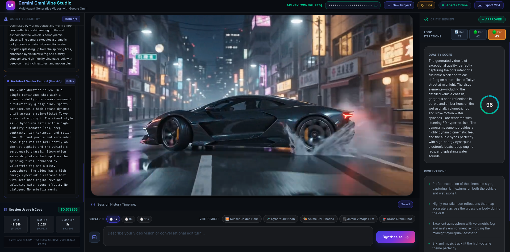
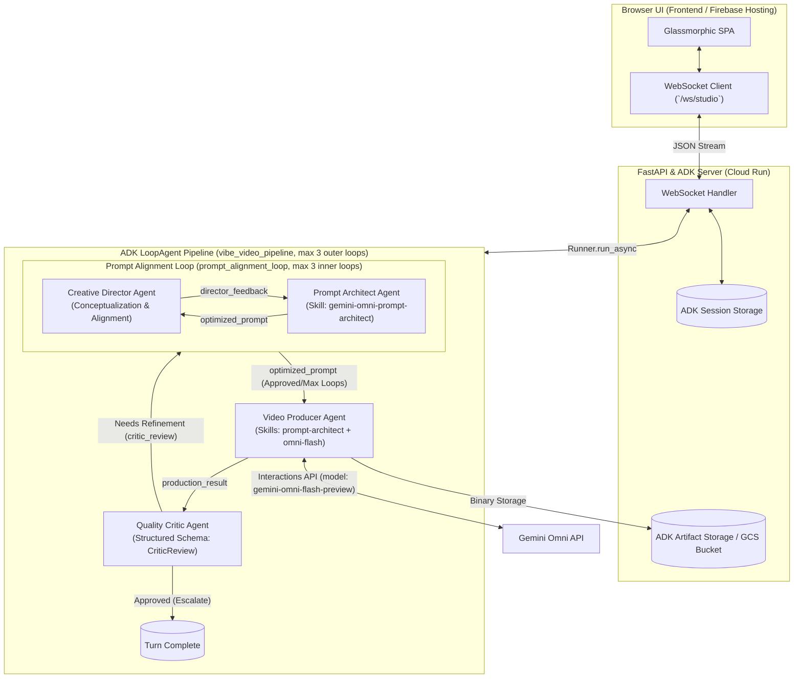

# Gemini Omni Vibe Video Studio

**Gemini Omni Vibe Video Studio** is an advanced, production-grade generative video platform built on top of the **Google Agent Development Kit (ADK)** and powered by the **Gemini Omni Flash** (`gemini-omni-flash-preview`) model via the **Interactions API**.

[](https://raw.githubusercontent.com/jggomez/vibe-video-gemini-omni/main/video_images/video1.mp4)

It features an autonomous 4-agent pipeline operating in a nested iterative loop pattern: an inner **Prompt Alignment Loop** between the **Creative Director** and **Prompt Architect**, followed by the **Video Producer**, and finished by the outer **Quality Critic** evaluation loop. This pipeline establishes artistic concepts, optimizes cinematic prompts using a 6-dimension framework, handles stateful conversational video editing across multiple turns, and performs automated quality assurance.

---

## Cinematic Video Examples

Below is a cinematic video example generated dynamically by the 4-agent pipeline using the `gemini-omni-flash-preview` model. 

### [▶️ Play Sample Video (Direct Stream)](https://raw.githubusercontent.com/jggomez/vibe-video-gemini-omni/main/video_images/video1.mp4)

*(Click on the video link above or the screenshot at the top to watch and stream the generated output directly in your browser).*

---

## System Architecture

The studio uses a decoupled architecture: a reactive Vanilla JS single-page application (SPA) communicates in real time via WebSockets with a high-throughput **FastAPI** server that wraps the ADK Multi-Agent Orchestrator.



---

## 4-Agent Pipeline Workflow

The generation pipeline follows a nested, multi-stage agent loop structure designed to maximize visual quality and prompt fidelity:

```mermaid
flowchart LR
    %% Nodes
    Start([User Request])
    Director["1. Creative Director<br><i>(Visual Concept)</i>"]
    Architect["2. Prompt Architect<br><i>(6-Dim Prompt)</i>"]
    Producer["3. Video Producer<br><i>(Gemini Omni Flash)</i>"]
    Critic["4. Quality Critic<br><i>(Quality QA)</i>"]
    Done([Turn Complete])

    %% Flow Connections
    Start --> Director
    
    subgraph InnerLoop ["Prompt Alignment Loop (max 3 runs)"]
        Director --> Architect
        Architect -->|Feedback| Director
    end

    Architect -->|Approved Prompt| Producer
    Producer --> Critic
    
    Critic -->|Approved Video| Done
    Critic -.->|Needs Refinement| Director

    %% Design Themes (High Contrast for GitHub Light/Dark)
    style Start fill:#1f6feb,stroke:#58a6ff,color:#ffffff,stroke-width:2px
    style Done fill:#238636,stroke:#2ea44f,color:#ffffff,stroke-width:2px
    style Director fill:#9e6a00,stroke:#d29922,color:#ffffff,stroke-width:1.5px
    style Architect fill:#0d47a1,stroke:#58a6ff,color:#ffffff,stroke-width:1.5px
    style Producer fill:#4a148c,stroke:#bc8cff,color:#ffffff,stroke-width:1.5px
    style Critic fill:#00695c,stroke:#34d399,color:#ffffff,stroke-width:1.5px
    
    style InnerLoop fill:#0f141c,stroke:#30363d,stroke-width:1px,stroke-dasharray: 4 4
```



### 1. Creative Director Agent (`creative_director`)
*   **Role**: Establishes the macro visual concept and outlines the artistic/production direction (color palette, pacing, environment, character detail) based on the user's initial prompt.
*   **Prompt Alignment Review**: In subsequent iterations of the inner loop, it reviews the `optimized_prompt` drafted by the Prompt Architect to verify visual alignment with the concept.
*   **Output**: Structured `CreativeDirectorReview` JSON containing:
    *   `production_concept` (string): The overall cinematic concept.
    *   `director_approved` (boolean): `True` if the architect's prompt matches the concept; `False` otherwise.
    *   `director_feedback` (string): Actionable alignment feedback for the architect.
*   **Escalate Callback**: Triggers an early exit from the inner loop via `_director_after_agent_callback` when `director_approved` is `True`.

### 2. Prompt Architect Agent (`prompt_architect`)
*   **Role**: Transforms raw user intent into precision 6-dimension cinematic prompts.
*   **Inputs**: Consumes the `creative_director_review` (using its concept and alignment feedback to draft/refine the prompt) and any previous `critic_review` (to address video quality failures).
*   **Output**: A single optimized prompt string stored in `optimized_prompt`.

### 3. Video Producer Agent (`video_producer`)
*   **Role**: Executes the Gemini Omni Flash (`gemini-omni-flash-preview`) model via the Interactions API using custom tools (`generate_video` or `edit_video`).
*   **Output**: Binary MP4 stored in GCS/Local Artifacts, returning a metadata object stored in `production_result`.

### 4. Quality Critic Agent (`critic`)
*   **Role**: Performs automated QA. Receives actual video bytes via `_critic_inject_video_callback` for true visual perception.
*   **Output**: Structured `CriticReview` JSON defining quality scores, status (`approved` or `needs_refinement`), feedback points, and refinement suggestions.
*   **Escalate Callback**: Triggers turn completion early if the video is approved; otherwise, loops back to the Creative Director for refinement.

---

## Agent Skills & Tools Reference

### Agent Skills

The agents consume predefined skills loaded via the ADK Skillset. For production-grade installations, you can leverage and install custom-built video skills designed specifically for Gemini Omni Flash:

*   **Author's Video Skills Catalog**: Discover custom prompt blueprints and cinematic workflows at [gemini-omni-video-skills](https://github.com/jggomez/gemini-omni-video-skills).
*   **Model-specific skills loaded locally**:
    *   **`gemini-omni-prompt-architect`**: Attached to `prompt_architect` and `video_producer`. Provides prompt structuring rules, preservation guardrails, and multimodal synthesis standards.
    *   **`gemini-omni-flash`**: Attached to `video_producer`. Provides master orchestration rules for the `gemini-omni-flash-preview` model, unary payload settings, and Interaction API conventions.

### Agent Tools
| Tool Name | Assigned Agent | Description |
| :--- | :--- | :--- |
| `generate_video` | `video_producer` | Generates a new video from scratch via Gemini Omni Interactions API. Handles safety exception blocks. |
| `edit_video` | `video_producer` | Modifies an existing video by chaining `previous_interaction_id`. Intercepts content guidelines blocks. |
| `get_video_artifact` | `video_producer` | Retrieves and verifies artifact existence in storage. |

### Model Context Protocol (MCP) Integration
For local development, automation scripts, and workflow execution, the application can interface with specialized MCP Servers to access science-database plugins, DevTools, or external execution sandboxes.

---

## Local Development & Setup

### Prerequisites
- **Python**: `>=3.11, <3.14`
- **Package Manager**: [`uv`](https://github.com/astral-sh/uv) (recommended) or standard `pip`.
- **API Key**: A valid Gemini / Google GenAI API Key with access to the `gemini-omni-flash-preview` model.

### 1. Clone & Environment Setup
```bash
git clone https://github.com/your-org/vibe-video-gemini.git
git submodule update --init --recursive
cd vibe-video-gemini
```

Create a `.env` file in the root directory:
```env
GEMINI_API_KEY="your-gemini-api-key-here"
# Optional: Google Cloud Storage bucket for production artifact persistence
# LOGS_BUCKET_NAME="your-gcs-bucket-name"
```

### 2. Install Dependencies
Using `uv`:
```bash
uv sync
```
*Or using standard pip:*
```bash
pip install -e .
```

### 3. Run the Application
Start the development server:
```bash
uv run python main.py
```
*The application will start at **http://localhost:8000**.*

### 4. Running Tests & Code Quality
Run all unit and integration tests:
```bash
uv run python -m pytest tests/unit/ tests/integration/ -v
```

Run linting checks with Ruff:
```bash
uv run ruff check main.py app/ backend/
```

---

## License

Distributed under the MIT License. See `LICENSE` for more information.
