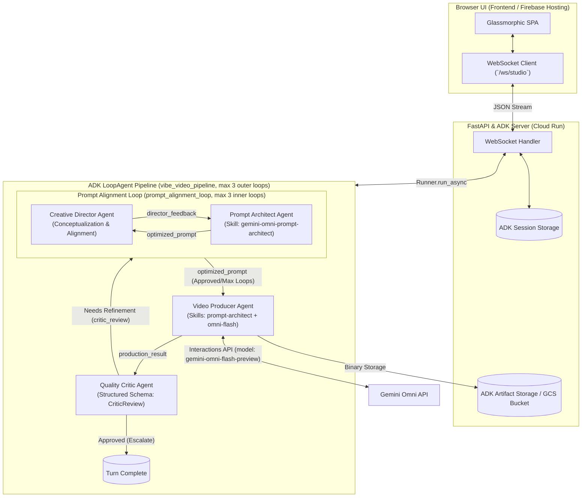

# Gemini Omni Vibe Video Studio

**Gemini Omni Vibe Video Studio** is an advanced, production-grade generative video platform built on top of the **Google Agent Development Kit (ADK)** and powered by the **Gemini Omni Flash** (`gemini-omni-flash-preview`) model via the **Interactions API**.


It features an autonomous 4-agent pipeline operating in a nested iterative loop pattern: an inner **Prompt Alignment Loop** between the **Creative Director** and **Prompt Architect**, followed by the **Video Producer**, and finished by the outer **Quality Critic** evaluation loop. This pipeline establishes artistic concepts, optimizes cinematic prompts using a 6-dimension framework, handles stateful conversational video editing across multiple turns, and performs automated quality assurance.

---

## Cinematic Video Examples

Below is an example of a cinematic video generated dynamically by the 4-agent pipeline using the `gemini-omni-flash-preview` model:

https://github.com/jggomez/vibe-video-gemini-omni/assets/video1.mp4

*(Note: If viewing on GitHub, you can view the video file directly at [video_images/video1.mp4](video_images/video1.mp4))*

---

## System Architecture

The studio uses a decoupled architecture: a reactive Vanilla JS single-page application (SPA) communicates in real time via WebSockets with a high-throughput **FastAPI** server that wraps the ADK Multi-Agent Orchestrator.



---

## 4-Agent Pipeline Workflow

The generation pipeline follows a nested, multi-stage agent loop structure designed to maximize visual quality and prompt fidelity:

```
[User Request]
      │
      ▼
┌─────────────────────────────────────────────────────────┐
│  Prompt Alignment Loop (Inner Loop, Max 3 Iterations)   │
│                                                         │
│   1. Creative Director establishes visual concept       │
│      (or reviews optimized_prompt in later turns)       │
│                           │                             │
│                           ▼                             │
│   2. Prompt Architect creates/refines optimized_prompt  │
│                                                         │
│   Does Director approve? ───[YES (or 3 loops)]───┐      │
└──────────────────────────────────────────────────│──────┘
                                                   │
                                                   ▼
                                         3. Video Producer
                                            (Gemini Omni Flash)
                                                   │
                                                   ▼
┌──────────────────────────────────────────────────│──────┐
│  Quality Critic Loop (Outer Loop, Max 3 Turns)   │      │
│                                                         │
│   4. Critic evaluates video quality & consistency       │
│                                                         │
│   Does Critic approve? ───[NO (Needs Refinement)]┘      │
│            │                                            │
│         [YES]                                           │
│            ▼                                            │
│     [Turn Complete]                                     │
└─────────────────────────────────────────────────────────┘
```

### 1. Creative Director Agent (`creative_director`)
*   **Role**: Establishes the macro visual concept and outlines the artistic/production direction (color palette, pacing, environment, character detail) based on the user's initial prompt.
*   **Prompt Alignment Review**: In subsequent iterations of the inner loop, it reviews the `optimized_prompt` drafted by the Prompt Architect to verify visual alignment with the concept.
*   **Output**: Structured `CreativeDirectorReview` JSON containing:
    *   `production_concept` (string): The overall cinematic concept.
    *   `director_approved` (boolean): `True` if the architect's prompt matches the concept; `False` otherwise.
    *   `director_feedback` (string): Actionable alignment feedback for the architect.
*   **Escalate Callback**: Triggers an early exit from the inner loop via `_director_after_agent_callback` when `director_approved` is `True`.

### 2. Prompt Architect Agent (`prompt_architect`)
*   **Role**: Transforms raw user intent into precision 6-dimension cinematic prompts.
*   **Inputs**: Consumes the `creative_director_review` (using its concept and alignment feedback to draft/refine the prompt) and any previous `critic_review` (to address video quality failures).
*   **Output**: A single optimized prompt string stored in `optimized_prompt`.

### 3. Video Producer Agent (`video_producer`)
*   **Role**: Executes the Gemini Omni Flash (`gemini-omni-flash-preview`) model via the Interactions API using custom tools (`generate_video` or `edit_video`).
*   **Output**: Binary MP4 stored in GCS/Local Artifacts, returning a metadata object stored in `production_result`.

### 4. Quality Critic Agent (`critic`)
*   **Role**: Performs automated QA. Receives actual video bytes via `_critic_inject_video_callback` for true visual perception.
*   **Output**: Structured `CriticReview` JSON defining quality scores, status (`approved` or `needs_refinement`), feedback points, and refinement suggestions.
*   **Escalate Callback**: Triggers turn completion early if the video is approved; otherwise, loops back to the Creative Director for refinement.

---

## Core Components Breakdown

### 1. Backend Orchestration ([main.py](file:///Users/jggomez/Documents/jggomez/code/vibe-video-gemini/main.py))
- **FastAPI & ADK Integration**: Wraps ADK's `get_fast_api_app` to expose REST endpoints (`/api/health`, `/api/upload`, `/api/videos/{artifact_name}`) and the WebSocket endpoint (`/ws/studio`).
- **Dynamic Connection & Context Isolation**: Restricts and isolates standard/live API clients via request context variables (`user_api_client_var` and `user_live_client_var`) using user-supplied session keys.
- **WebSocket Event Dispatcher Delegation**: Delegates FSM loop boundary detection and WebSocket serialization to `StudioEventDispatcher`.

### 2. WebSocket Event Dispatcher ([backend/event_dispatcher.py](file:///Users/jggomez/Documents/jggomez/code/vibe-video-gemini/backend/event_dispatcher.py))
- **Orchestration FSM**: Encapsulates iteration FSM boundary detection, resetting loop states when returning to the Creative Director (`creative_director`) from the Prompt Architect or Critic.
- **Streaming Event Serialization**: Formats and transmits WebSocket events (`agent_thinking`, `agent_done`, `turn_complete`) containing real-time agent output (including `creative_director_review`).
- **Token & Cost Analytics**: Tracks token consumption for all 4 agents and calculations for total run cost, reporting them to the client.

### 3. Multi-Agent Pipeline ([app/agent.py](file:///Users/jggomez/Documents/jggomez/code/vibe-video-gemini/app/agent.py))
The pipeline is managed by an ADK `SequentialAgent` named `vibe_video_pipeline` containing:
- **Prompt Alignment Loop (`prompt_alignment_loop`)**: A nested `LoopAgent` coordinating `creative_director` and `prompt_architect` (max 3 inner iterations per outer loop).
- **Video Producer (`video_producer`)**: Runs prompt execution.
- **Quality Critic (`critic`)**: Performs visual review, triggering escalation upon approval.

### 4. Typed Session State ([app/state_helper.py](file:///Users/jggomez/Documents/jggomez/code/vibe-video-gemini/app/state_helper.py))
- **Primitive Obsession Elimination**: Strongly-typed wrappers over the ADK `tool_context.state` dictionary to manage session keys (`last_interaction_id`, `last_artifact_name`, `current_turn`, and `production_result`) reliably.

### 5. Instructions & Prompt Engineering ([app/prompts.py](file:///Users/jggomez/Documents/jggomez/code/vibe-video-gemini/app/prompts.py))
- **Dynamic File Loader**: Decouples agent instructions from code. Prompts are read dynamically from clean Markdown files under [`app/instructions/`](file:///Users/jggomez/Documents/jggomez/code/vibe-video-gemini/app/instructions/):
  - [`creative_director.md`](file:///Users/jggomez/Documents/jggomez/code/vibe-video-gemini/app/instructions/creative_director.md): Conceptualization guidelines, subsequent turn alignment checks, and English-only strict output.
  - [`prompt_architect.md`](file:///Users/jggomez/Documents/jggomez/code/vibe-video-gemini/app/instructions/prompt_architect.md): 6-Dimension framework, edit-turn preservation, safety sanitization, and director/critic loop feedback rules.
  - [`video_producer.md`](file:///Users/jggomez/Documents/jggomez/code/vibe-video-gemini/app/instructions/video_producer.md): Interactions API settings.
  - [`critic.md`](file:///Users/jggomez/Documents/jggomez/code/vibe-video-gemini/app/instructions/critic.md): Quality scoring rubrics and content safety handling.

### 6. Custom Tools ([app/tools.py](file:///Users/jggomez/Documents/jggomez/code/vibe-video-gemini/app/tools.py))
- **`generate_video`**: Calls `client.interactions.create` with `model="gemini-omni-flash-preview"`, generating initial video binaries and saving them to ADK Artifacts.
- **`edit_video`**: Performs stateful video editing by chaining `previous_interaction_id` across turns.
- **`get_video_artifact`**: Inspects and retrieves stored video artifacts from storage.

### 7. Data Schemas ([app/schemas.py](file:///Users/jggomez/Documents/jggomez/code/vibe-video-gemini/app/schemas.py))
- **`CreativeDirectorReview`**: Pydantic model defining `production_concept`, `director_approved`, and `director_feedback`.
- **`CriticReview`**: Pydantic model defining structured QA output (`score`, `status`, `summary`, `feedback_points`, and `refinement_suggestions`).

### 8. Reactive Frontend ([frontend/](file:///Users/jggomez/Documents/jggomez/code/vibe-video-gemini/frontend/))
- **Advanced Player Overlays**: Mute toggle, SVG playback buttons, and volume control.
- **Agent Output Cards**: Live status dashboard displaying the Creative Director's production concept and approval feedback alongside prompt architectural steps and critic metrics.
- **Safety Block Canvas**: Shows warnings if content violates safety guidelines.
- **WebSocket Fault-Tolerance**: Elegant reconnection handling and error logs.

---

## Agent Skills & Tools Reference

### Agent Skills

The agents consume predefined skills loaded via the ADK Skillset. For production-grade installations, you can leverage and install custom-built video skills designed specifically for Gemini Omni Flash:

*   **Author's Video Skills Catalog**: Discover custom prompt blueprints and cinematic workflows at [gemini-omni-video-skills](https://github.com/jggomez/gemini-omni-video-skills).
*   **Model-specific skills loaded locally**:
    *   **`gemini-omni-prompt-architect`**: Attached to `prompt_architect` and `video_producer`. Provides prompt structuring rules, preservation guardrails, and multimodal synthesis standards.
    *   **`gemini-omni-flash`**: Attached to `video_producer`. Provides master orchestration rules for the `gemini-omni-flash-preview` model, unary payload settings, and Interaction API conventions.

### Agent Tools
| Tool Name | Assigned Agent | Description |
| :--- | :--- | :--- |
| `generate_video` | `video_producer` | Generates a new video from scratch via Gemini Omni Interactions API. Handles safety exception blocks. |
| `edit_video` | `video_producer` | Modifies an existing video by chaining `previous_interaction_id`. Intercepts content guidelines blocks. |
| `get_video_artifact` | `video_producer` | Retrieves and verifies artifact existence in storage. |

### Model Context Protocol (MCP) Integration
For local development, automation scripts, and workflow execution, the application can interface with specialized MCP Servers to access science-database plugins, DevTools, or external execution sandboxes.

---

## Local Development & Setup

### Prerequisites
- **Python**: `>=3.11, <3.14`
- **Package Manager**: [`uv`](https://github.com/astral-sh/uv) (recommended) or standard `pip`.
- **API Key**: A valid Gemini / Google GenAI API Key with access to the `gemini-omni-flash-preview` model.

### 1. Clone & Environment Setup
```bash
git clone https://github.com/your-org/vibe-video-gemini.git
git submodule update --init --recursive
cd vibe-video-gemini
```

Create a `.env` file in the root directory:
```env
GEMINI_API_KEY="your-gemini-api-key-here"
# Optional: Google Cloud Storage bucket for production artifact persistence
# LOGS_BUCKET_NAME="your-gcs-bucket-name"
```

### 2. Install Dependencies
Using `uv`:
```bash
uv sync
```
*Or using standard pip:*
```bash
pip install -e .
```

### 3. Run the Application
Start the development server:
```bash
uv run python main.py
```
*The application will start at **http://localhost:8000**.*

### 4. Running Tests & Code Quality
Run all unit and integration tests:
```bash
uv run python -m pytest tests/unit/ tests/integration/ -v
```

Run linting checks with Ruff:
```bash
uv run ruff check main.py app/ backend/
```

---

## License

Distributed under the MIT License. See `LICENSE` for more information.
